  

  

---

### 👋 About Me

- 🎓 BCA (Bachelor of Computer Applications), VNSGU — graduating 2026
- 💼 Generative AI Engineer, working across GenAI, automation, and full-stack AI systems
- 🧠 Focused on RAG pipelines, agentic workflows, and LLM-powered applications end-to-end (data ingestion → retrieval → API → UI)
- 🚀 Interned as a Gen AI Developer at UpValence Automation, shipping sequential and agentic workflow projects
- 📫 Reach me: **moxsh.777@gmail.com**

---

### 🛠️ Tech Stack

**Generative AI & LLM Engineering**

**Backend & APIs**

**Frontend**

**Databases & Vector Stores**

**Tools & DevOps**

---

### 🚀 Featured Projects

<table>
<tr>
<td width="50%" valign="top">

**🛡️ [Sentinel AI](https://github.com/moxshhh-777/Sentinel-AI)**

Agentic decision intelligence platform with autonomous agent orchestration (Supervisor → Planning → Agent Registry → Reasoning → Recommendation). V1 targets financial intelligence — market data, news, and risk agents.

`FastAPI` `LangGraph` `PostgreSQL` `Next.js`

</td>
<td width="50%" valign="top">

**🕉️ [Premanand AI Supporter](https://github.com/ZealArdeshna/Premanand_AI_Supporter)**

Multilingual RAG chatbot over 7,400+ transcribed spiritual discourses, with answers synced to exact YouTube timestamps. Hybrid retrieval (BM25 + FAISS) with zero-hallucination grounding.

`LangChain` `Azure OpenAI` `FAISS` `Next.js`

</td>
</tr>
<tr>
<td colspan="2" valign="top">

**🎓 [College Website Chatbot](https://github.com/moxshhh-777/College_Website_Chatbot)**

Production-style RAG chatbot answering queries from scraped college website data — recursive scraper, semantic chunking, FAISS retrieval, and a Groq-powered (Llama 3) response layer behind a FastAPI backend.

`FastAPI` `FAISS` `Groq` `Streamlit`

</td>
</tr>
</table>

---

### 📊 GitHub Stats

  
  

  

---

### 🐍 Contribution Snake

  

---

### 🌐 Let's Connect

  
  
  

<i>See you in the next commit ✨</i>

